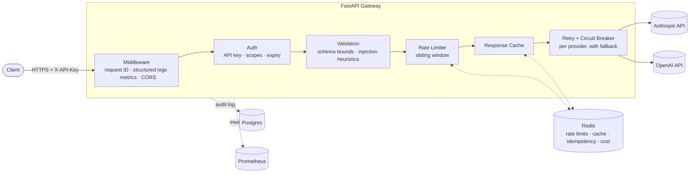

# Production API Wrapper

A production-grade gateway that sits in front of Anthropic and OpenAI behind one unified API — with the reliability, security, and observability features a real LLM gateway needs in production, not just a thin pass-through proxy.

[](https://github.com/vikasjha1/production-api-wrapper/actions/workflows/ci.yml)

## What this is

Call `/v1/chat/anthropic` or `/v1/chat/openai` with the same request shape, and the gateway handles the rest: authentication, per-client rate limiting, response caching, retries with backoff, circuit breaking per provider, automatic fallback to a secondary provider, idempotent replays, cost tracking, a full audit trail, and Prometheus metrics — all before the request ever reaches the underlying provider.

## Architecture



Every request flows through the same pipeline regardless of which provider it targets — that's the point of the gateway: provider-specific quirks (error formats, response shapes, model naming) are normalized at the adapter boundary, so nothing above it needs to know which provider is actually being called.

## Features

**Reliability**
- Retry with exponential backoff + jitter on transient (5xx/timeout) failures — 4xx errors fail fast, they won't succeed on retry
- Per-provider circuit breaker — stops hammering a provider that's already down instead of queuing up failures
- Optional automatic fallback to a secondary provider/model when the primary fails
- Idempotency keys — safe request replay without double-executing (and double-billing) a call
- Tuned shared HTTP connection pool instead of a new connection per request

**Security**
- API-key authentication, with optional per-key provider scopes and expiry
- CORS: off by default (this API is header-authenticated, not cookie-based, so there's no default cross-origin need), opt-in per deployment
- Request schema hardening — bounded message length, message count, `max_tokens`, and `temperature`, closed enum for message `role`
- Non-blocking prompt-injection heuristic detection, flagged in the audit log and via response header for review — a detection signal, not a filter (see [Design Notes](#design-notes))

**Observability**
- Structured JSON logs, correlated by request ID across every log line for a request
- Prometheus `/metrics` with cardinality-safe route-template labeling (`/v1/chat/{provider}`, not one label per literal provider)
- Persistent Postgres audit log of every request: status, cost, latency, token usage, cache hit, fallback use
- `/v1/health` (liveness) and `/v1/ready` (readiness — checks Redis and Postgres so a load balancer stops routing before things actually break)

## Quick start

```bash
git clone https://github.com/vikasjha1/production-api-wrapper.git
cd production-api-wrapper
cp .env.example .env
# edit .env: add ANTHROPIC_API_KEY / OPENAI_API_KEY and an API_KEYS entry, e.g.
#   API_KEYS={"my-local-key": "local-dev"}

docker compose up --build
```

This starts the gateway, Redis, and Postgres together, wired to talk to each other automatically (the gateway runs its database migrations on startup). Then:

```bash
curl http://localhost:8000/v1/health

curl -X POST http://localhost:8000/v1/chat/anthropic \
  -H "X-API-Key: my-local-key" \
  -H "Content-Type: application/json" \
  -d '{
        "model": "claude-haiku-4-5-20251001",
        "messages": [{"role": "user", "content": "Say hi in one word"}]
      }'
```

## API reference

| Method | Path | Auth | Description |
|---|---|---|---|
| `GET` | `/v1/health` | none | Liveness — is the process alive |
| `GET` | `/v1/ready` | none | Readiness — can Redis and Postgres actually be reached |
| `GET` | `/v1/me` | API key | Identify the calling client |
| `POST` | `/v1/chat/{provider}` | API key | Send a chat request to `anthropic` or `openai` |
| `GET` | `/v1/usage` | API key | Running cost total for the calling client |
| `GET` | `/metrics` | none | Prometheus scrape endpoint |

## Configuration

Everything is environment-driven — see [`.env.example`](.env.example) for the full, documented list (rate limits, retry/circuit-breaker tuning, cache TTL, connection pool sizing, CORS origins, per-key scopes and expiry). Nothing here needs a code change to reconfigure for a different environment.

## Running tests

```bash
uv sync
uv run ruff check .
uv run ruff format --check .
uv run mypy app
uv run pytest
```

The same four checks run in CI on every push. Tests are isolated from real infrastructure — `respx` mocks provider HTTP calls, `fakeredis` stands in for Redis, and a throwaway SQLite database stands in for Postgres — so the suite needs no live services to run.

## Design notes

A few decisions worth calling out, since they're easy to get wrong:

- **Prompt-injection handling is detection, not prevention.** There's no reliable syntactic boundary between "instructions" and "data" in natural language, so a keyword filter that blocks requests would be both bypassable and prone to false positives. The gateway flags suspicious patterns in the audit log and a response header for human review instead of rejecting them outright.
- **CORS is opt-in, not permissive-by-default.** This API authenticates via a header (`X-API-Key`), not cookies, so there's no CSRF surface driving a need for CORS — it only matters once a specific browser-based frontend needs to call the gateway directly.
- **Readiness checks Redis and Postgres, not the upstream LLM providers.** Provider failures are already handled by retry/circuit-breaker/fallback; readiness is about whether *this service's own* dependencies are reachable, which is what a load balancer actually needs to know before routing traffic here.
- **Cost tracking falls back to longest-prefix matching** on model name, because providers often respond with a more specific, dated model string (`gpt-4o-mini-2024-07-18`) than the alias that was requested (`gpt-4o-mini`).

## Tech stack

FastAPI · Pydantic v2 · SQLAlchemy 2.0 (async) + Alembic · asyncpg · Redis · Postgres · httpx · Prometheus · pytest · ruff · mypy (strict) · Docker · GitHub Actions
